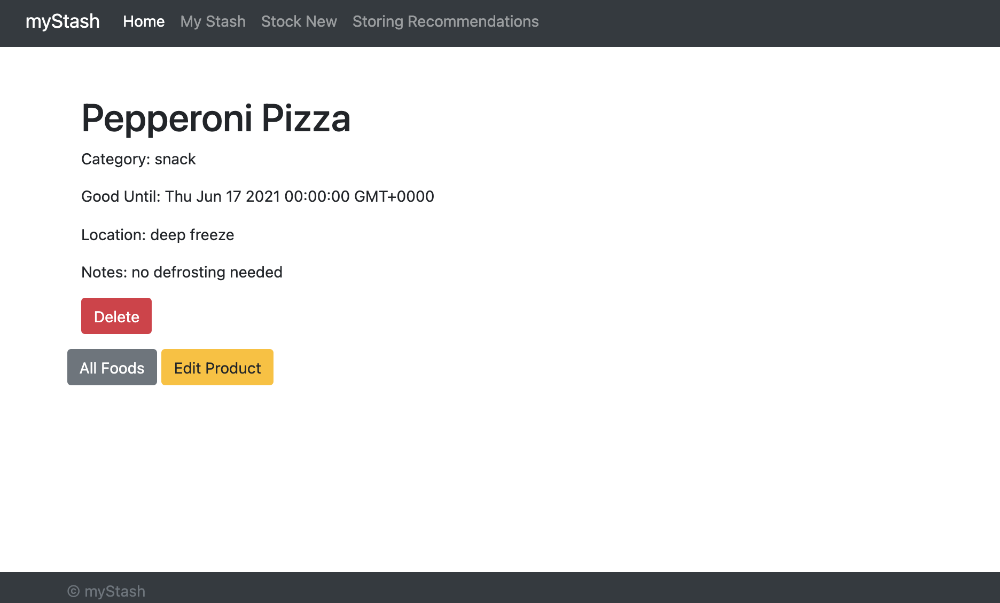

# myStash

## About
This web app was created to help assist in keeping track of food inventory. 

Features:
* Update/delete food inventory
* Display all inventory
* Search through food inventory

Tools used include:
* [Bootstrap](https://getbootstrap.com/)(css styling)
* [Express](https://expressjs.com/)(web framework)
* [MongoDB](https://www.mongodb.com/community)(database)

## Project Setup

1. Download all project files from github 
2. Install all modules: 
    1. Go to terminal & type in: `npm init`
    2. Type in: `npm install` 

## Running Project
Go to terminal (make sure you are in myStash project folder) & type in: `nodemon app.js`

## Future Updates
* Current Page-Menu Highlights
* Login with Credentials
* Message/Error Alerts